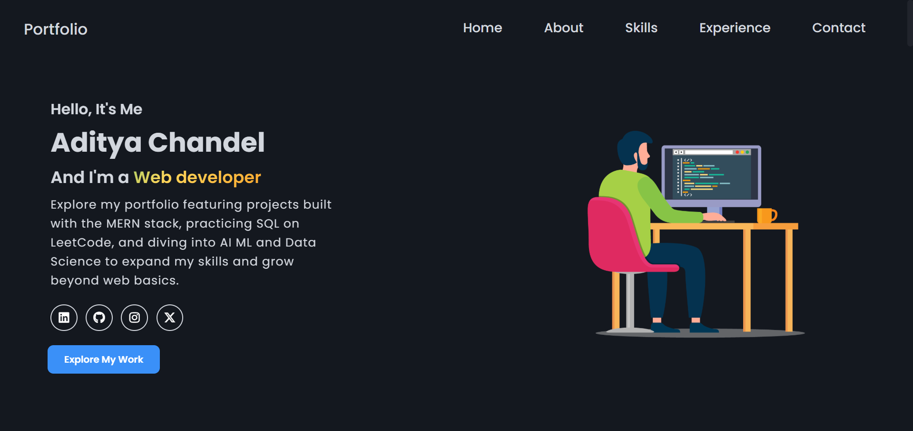

<<<<<<< HEAD
# 📌 Personal Portfolio Website

Welcome to my **Personal Portfolio Website**! 🚀 This website showcases my skills, experience, and projects as a Computer Science student. It is designed to be fully responsive, interactive, and visually appealing using **HTML, CSS, JavaScript**, and **Font Awesome** icons.

---

## 🔥 Features

✅ **Responsive Design** – Adapts seamlessly to all screen sizes (desktop, tablet, and mobile).  
✅ **Smooth Animations** – JavaScript-powered animations enhance user experience.  
✅ **Home Section** – A brief introduction about me and my goals.  
✅ **About Section** – Contains details about my education.  
✅ **Skills Section** – Technologies and tools I am proficient in.  
✅ **Projects Section** – Featured projects I have built.  
✅ **Contact Section** – Provides a mailto link for direct emails.  

---

## 🌐 Live Demo

🚀 **Check it out here**: [Portfolio Website]()

---

## 📸 Screenshots

### 🏡 Home Page

---

## 🛠 Built With

- **HTML5** – Structure and content
- **CSS3** – Styling and layout
- **JavaScript** – Animations & interactivity
- **Font Awesome** – Icons for navigation, social links, and projects
- **Media Queries** – For a responsive and mobile-friendly design

---

## 📌 Acknowledgments

🔹 **Inspiration** – Inspired by various online portfolio designs and tutorials.  
🔹 **Resources** – Icons used in this project are provided by [Font Awesome](https://fontawesome.com/).

---

## 🎯 Contributing

Want to build your own portfolio? Feel free to fork this repository, customize it, and make it your own! 🚀

---

### 👨‍💻 Author: **Aditya Chandel**
=======
# 📌 Personal Portfolio Website

Welcome to my **Personal Portfolio Website**! 🚀 This website showcases my skills, experience, and projects as a Computer Science student. It is designed to be fully responsive, interactive, and visually appealing using **HTML, CSS, JavaScript**, and **Font Awesome** icons.

---

## 🔥 Features

✅ **Responsive Design** – Adapts seamlessly to all screen sizes (desktop, tablet, and mobile).  
✅ **Smooth Animations** – JavaScript-powered animations enhance user experience.  
✅ **Home Section** – A brief introduction about me and my goals.  
✅ **About Section** – Contains details about my education.  
✅ **Skills Section** – Technologies and tools I am proficient in.  
✅ **Projects Section** – Featured projects I have built.  
✅ **Contact Section** – Provides a mailto link for direct emails.  

---

## 🌐 Live Demo

🚀 **Check it out here**: [Portfolio Website]()

---

## 📸 Screenshots

### 🏡 Home Page

---

## 🛠 Built With

- **HTML5** – Structure and content
- **CSS3** – Styling and layout
- **JavaScript** – Animations & interactivity
- **Font Awesome** – Icons for navigation, social links, and projects
- **Media Queries** – For a responsive and mobile-friendly design

---

## 📌 Acknowledgments

🔹 **Inspiration** – Inspired by various online portfolio designs and tutorials.  
🔹 **Resources** – Icons used in this project are provided by [Font Awesome](https://fontawesome.com/).

---

## 🎯 Contributing

Want to build your own portfolio? Feel free to fork this repository, customize it, and make it your own! 🚀

---

### 👨‍💻 Author: **Aditya Chandel**
>>>>>>> 5d74177e318585b886270be188078ca264f117fd
